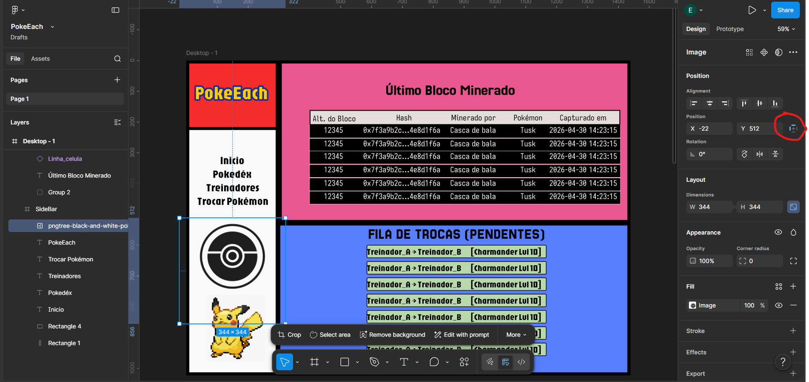
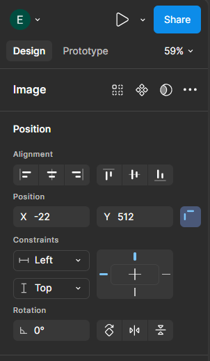

# `Constraints` (Restrições)

Voltar ao [Glossário de Conceitos](README.md) 

## O que é?

As **Constraints** (Restrições) definem como um elemento se comporta quando o Frame em que ele está (o Frame "pai") muda de tamanho. 

Para os meus web devs de padrão, as Constraints é o equivalente ao `position: absolute` combinado com `top`, `bottom`, `left` ou `right` do CSS. 

As Constraints só funcionam se o seu elemento estiver dentro de um Frame comum. Se o Frame pai estiver usando Auto Layout, o Auto Layout dá uma sequestrada nas regras e as Constraints são desativadas.

## Como funciona?

Você configura as restrições em dois eixos independentes: **Horizontal (X)** e **Vertical (Y)**.

- **Fixar (Left, Right, Top, Bottom):** Prende a distância do elemento em relação à borda escolhida. Se você ancorar um botão no *Bottom* e no *Right*, não importa o quanto você estique a tela, o botão sempre ficará colado no canto inferior direito.
- **Centralizar (Center):** Garante que o objeto fique sempre no meio da tela, ignorando as bordas.
- **Esticar (Left and Right / Top and Bottom):** Faz com que o elemento cresça e encolha junto com a tela. Muito útil para barras de navegação ou campos de texto que precisam ocupar toda a largura disponível.
- **Proporcional (Scale):** Aumenta ou diminui o elemento como se fosse um elástico, mantendo a proporção (em porcentagem) em relação ao Frame pai.

## Por que usar?

As Constraints são o que impedem a sua tela de "quebrar" quando você pega um design feito para um iPhone e tenta esticá-lo para a tela de um iPad, por exemplo. Elas garantem que menus fiquem no topo, rodapés fiquem embaixo e conteúdos centrais fiquem no meio.

## Formas de configurar

1. Selecione qualquer elemento que esteja **dentro de um Frame**.
2. Olhe para o painel da direita, na seção **Position**.
3. Clique no pequeno **ícone de ancoragem** (um quadrado com linhas) que fica à direita das caixas de coordenadas X e Y.

4. Vai abrir um pequeno menu flutuante onde você pode escolher onde quer "ancorar" o seu elemento (Horizontal e Vertical).

## Palavras chaves

`constraints`, `restrições`, `ancoragem`
