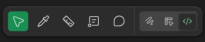

# `Dev Mode` (Modo de Desenvolvimento)

Voltar ao [Glossário de Conceitos](README.md) 

## O que é?

Agora chegamos no queridinho da galera e do setor de sites da COSSI! O **Dev Mode** é um espaço de trabalho dentro do Figma feito exclusivamente para desenvolvedores. Ele altera a interface da ferramenta: saem os painéis de criação e desenho, e entram ferramentas focadas em inspeção de medidas, extração de código e exportação de imagens.

Para nós, humildes codificadores, é o fim do chutômetro na hora de adivinhar o tamanho de uma margem, cor exata de uma sombra, a fonte, etc. que precisamos colocar no css do nosso código.

Você sabe que está no Dev Mode quando o ícone de código (`</>`) no canto superior direito fica com o fundo verde e a interface ao redor ganha contornos verdes, após clica-lo.

E muito infelizmente, ele não está disponível no plano gratuito do Figma, PORÉM! Não desanime, tem uma forma de você conseguir ter acesso ao Figma Pro utilizando o seu E-mail institucional da USP, algo que será abordado em alguma aula ae dessa nossa trilha.

## Como funciona?

O Dev Mode foca em três pilares principais para facilitar o *hand-off* (passagem de bastão do designer para o dev):

- **Inspeção de Layout (Box Model):** Ao passar o mouse sobre os elementos, você vê imediatamente as distâncias (em pixels) entre eles. O painel direito exibe o *Box Model* clássico do CSS (Width, Height, Padding, Border, Margin).
- **Geração de Código:** O painel traduz as propriedades visuais em código real. Você pode copiar trechos de CSS puro, variáveis, etc. 
- **Exportação de Assets (Assets):** Uma aba dedicada para você baixar as imagens, ícones e vetores da tela. Perfeito para exportar aquele ícone/logo em `.svg` ou `.png` transparente e jogar direto no seu repositório.

## Por que usar?

Ele acelera de forma comicamente absurda o desenvolvimento, já que não precisamos ter medo de quebrar o design acidentalmente ao tentar ver uma medida, pois o Dev Mode é um ambiente seguro de visualização.

## Como acessar

- **ícone do Dev Mode:** No canto superior direito da tela, procure o ícone de chaves de código `</>` e clique nele. 
- **Atalho no Teclado:** Pressione `Shift + D` para alternar rapidamente entre o modo de Design e o Dev Mode.

## Palavras chaves

`dev mode`, `inspecionar`, `hand-off`, `código`
