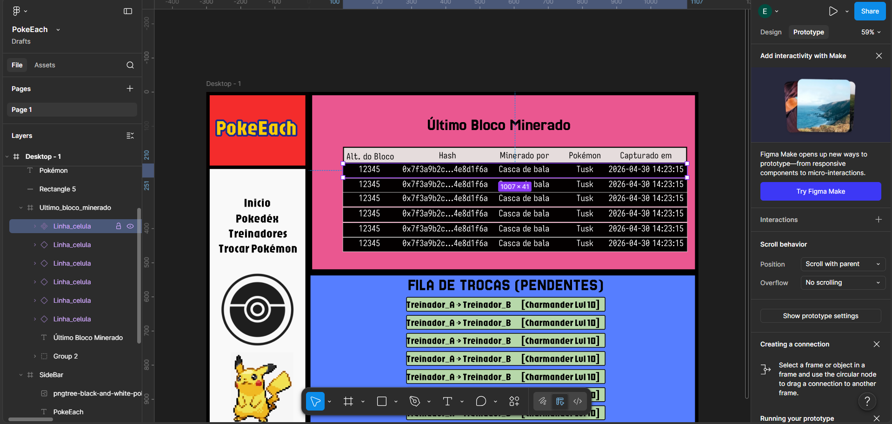

# `Instance` (Instância)

Voltar ao [Glossário de Conceitos](README.md) 

## O que é?

Uma **Instance** (Instância) é uma cópia "viva" de um Componente Mestre. Elas são os elementos que você realmente espalha pelas suas telinhass. Enquanto o Mestre define a regra, a Instância segue essa regra, mas permite pequenas variações locais.

Para desenvolvedores (e fãs do professor Coutinho ;D), se o Componente Mestre é a **Classe**, a Instância é o **Objeto** criado a partir dessa classe. 
Dá pra reconhecer uma Instância no painel de camadas pelo ícone de um losango simples vazado (◇).

Exemplo:

As Linha_celula com o losango simples vazado são instâncias da Linha_celula componente mestre, que possui o ícone de quatro losangos roxos (❖).

## Como funciona?

A relação entre Mestre e Instância é baseada em herança, mas com flexibilidade:

- **Herança Automática:** Se você mudar o raio da borda ou a cor no Componente Mestre, todas as Instâncias espalhadas pelo seu projeto irão mudar de forma instantânea.
- **Overrides (Sobrescritas):** Você pode alterar propriedades específicas de uma instância (como o texto interno, a cor de um ícone ou esconder uma camada interna) sem quebrar o vínculo com o Mestre. 
- **Limitações:** Você não pode deletar elementos dentro de uma Instância ou mudar a posição de itens internos livremente (para isso, você teria que alterar o Mestre ou usar o Auto Layout).

## Operações Comuns

- **Reset Instance:** Se tu bagunçou muito uma instância e quer consertar a farra foi feita, fazendo ela voltar a ser exatamente igual ao Mestre, clique com o botão direito e escolha *Reset all overrides*.
- **Push Changes to Main Component:** Se você fez uma alteração em uma instância e percebeu que ela ficou tão boa que deveria virar o novo padrão (confiança e auto estima lá em cima né, nós somos fodas), você pode "empurrar" essa mudança para o Mestre.
- **Go to Main Component:** Um atalho rápido para encontrar onde o Componente Mestre está escondido no seu projeto.
- **Detach Instance:** Quebra o vínculo com o Mestre permanentemente (tipo o Tai Lung com o Mestre Shifu), transformando a instância em um Frame comum.

## Palavras chaves

`instância`, `cópia`, `herança`, `sobrescrita`, `override`, `objeto`
