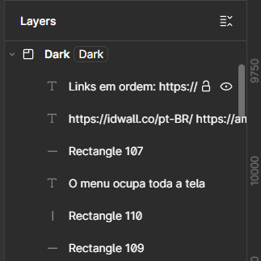

# `Layer`

Voltar ao [Glossário de Conceitos](README.md) 

## O que é?

A **Layer** (ou Camada) representa cada elemento individual que colocamos na tela. No Figma, tudo é uma camada: seja um retângulo, um texto, uma imagem ou até mesmo um Frame. O painel de camadas (localizado no lado esquerdo da interface) funciona como uma lista que determina a **ordem de empilhamento** dos objetos.
Ou seja, se tivermos um texto e ele estiver acima de um retângulo na lista de camadas, conseguimos colocar o texto "em cima" do retângulo. Já se fizemos o oposto, com retângulo acima e texto abaixo, o retângulo cobrirá o texto.

Também temos um ícone de **Olho** qe podemos clicar para esconder uma camada temporariamente sem precisar eliminar ela, muito útil pra ir testando variações de layouts (por exemplo, diferentes formantos de fontes de texto em cima de retângulo).

Além disso, também temos o ícone do **Cadeado**, que basicamente trava a camada e impede nós seres humanos bobinhos e atrapalhados de fazemos burrada de selecionar ou mover um objeto por acidente enquanto estamos mexendo em outras partes do design.

Exemplo:

## Algumas Dicas

Manter as camadas organizadas é essencial para o *hand-off* (passagem do design para o código):

1. **Nomes Claros:** Tenta evitar nomes genéricos (tipo os do exemplo acimakkkkkk) como "Rectangle Destruidor de Universos Número 43453333". Tenta deixar algo mais semântico `btn_confirmar` ou `card_transacao`. Isto facilita muito a vida dos seus amiguinhos que forem transformar o design em código. Obviamente as vezes é muito trabalho e talvez não valha a pena renomear cada coisinha, mas os principais é bom ter um nome claro.
2. **Pastas e Hierarquia:** Quando agrupamos (`Ctrl + G`) ou criamos Frames (`Ctrl + Alt + G`), estamos criando uma hierarquia. Use isso para agrupar elementos que pertencem à mesma lógica visual (ex: todos os elementos do cabeçalho dentro de um Frame chamado `Header`).

## Atalhos Principais

- **Renomear Camada:** Seleciona o item e aperte `Ctrl + R` 
- **Trazer para a Frente:** `]`
- **Enviar para Trás:** `[`
- **Esconder/Mostrar:** `Ctrl + Shift + H`

## Palavras chaves

`camada`, `empilhamento`, `organização`, `visibilidade`, `cadeado`
