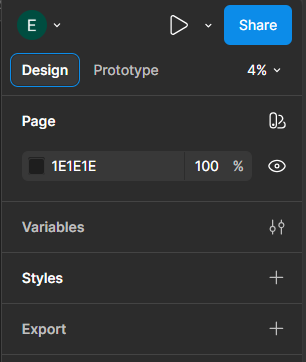
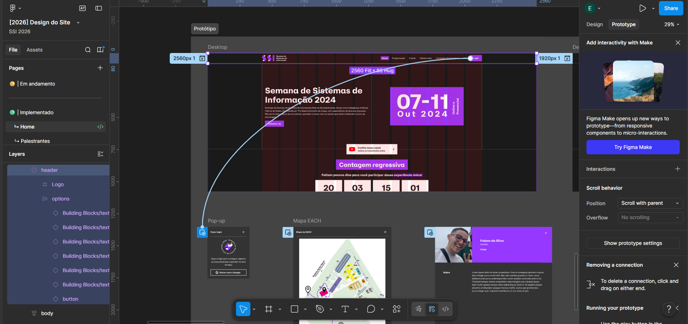

# `Prototype` (Prototipagem)

Voltar ao [Glossário de Conceitos](README.md) 

## O que é?

A aba de **Prototype** (Prototipagem) é onde você adiciona interatividade ao seu design estático. É com ela que você transforma telas soltas em um fluxo clicável, simulando como o aplicativo, site ou jogo vai funcionar na mão do usuário final antes mesmo de uma única linha de código ser escrita.

*Fun fact:* Acabei de lembrar que existe um jogo chamado Prototype, acho que vi uma review do Zangado sobre ele quando era mais novo, essa aqui: https://youtu.be/ePd0gL3EeMM?si=XjRLjB8WSfvKVuEX
E como assim tem dois jogos do Prototype, eu não fazia ideia nem lembrava disso, enfim perdão pelas divagações caro leitor.

Quando você entra no modo Prototype, aparecem pequenas bolinhas nas bordas dos elementos selecionados. As setas azuis que ligam uma tela à outra são carinhosamente chamadas de "Noodles" (Macarrões, inclusive queria comer um ainda não almocei aquikkkkkk).*

## Como funciona?

A lógica de prototipagem é dividida em três partes principais:

- **Triggers (Gatilhos):** É o evento que inicia a ação. Pode ser um clique (`On click`), passar o mouse por cima (`While hovering`), arrastar (`On drag`), ou até mesmo passar um tempo (`After delay`).
- **Actions (Ações):** O que acontece após o gatilho. O mais comum é navegar para outra tela (`Maps to`), mas você pode abrir um pop-up por cima da tela atual (`Open overlay`), rolar para um ponto específico (`Scroll to`), ou voltar para a tela anterior (`Back`).
- **Animations (Animações):** Como a transição visual ocorre. Pode ser um corte seco (`Instant`), uma transição suave (`Dissolve`), telas deslizando (`Slide in`) ou o **Smart Animate**, onde o Figma calcula a interpolação geométrica entre os elementos de uma tela para a outra, criando animações complexas automaticamente.
Meio dificil explicar Smart Animate em detalhes aqui, então vou deixar um link do próprio site do Figma para quem ficar curioso e quiser saber mais: https://help.figma.com/hc/en-us/articles/360039818874-Smart-animate-layers-between-frames

## Por que usar?

Validar uma ideia em código é caro, demorado e muuiiiittoooooooo chaaatooooo. O protótipo serve para testar o fluxo (ex: "O jogador consegue achar o botão de salvar facilmente no Persona 3 Reload?"), validar a experiência de uso e apresentar o projeto de forma muito mais palpável para a equipe.

## Formas de criar

1. No canto superior direito da tela, mude a aba de **Design** para **Prototype**.
- 
2. Selecione um elemento (como um botão) em um Frame.
3. Clique e segure a bolinha azul com o sinal de `+` que aparece na borda do elemento.
- 
4. Arraste a linha azul até o Frame de destino (a tela que deve abrir após o clique).
5. O painel de Interação vai abrir automaticamente para você configurar o *Trigger*, *Action* e *Animation*.
6. Clique no ícone de "Play" (Present) no canto superior direito para testar a simulação!

## Palavras chaves

`protótipo`, `interatividade`, `gatilhos`, `triggers`
