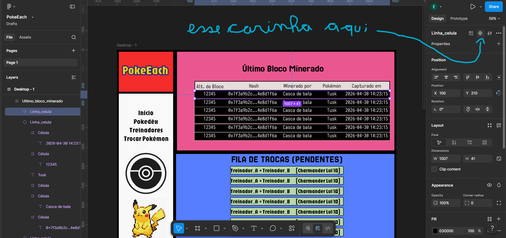

# `Variant` (Variante)

Voltar ao [Glossário de Conceitos](README.md) 

## O que é?

As **Variants** (Variantes, graças a Deus não as variantes do invencível (da série.....Invencible.....meio obvio eu acho) são uma forma de agrupar diferentes estados ou estilos de um mesmo Componente. Em vez de ter dezenas de componentes separados para cada situação (ex: um botão azul, um botão vermelho, um botão azul avermelhado, um botão vermelho azulado, um botão desativado), você cria um único componente "Botão" que contém todas essas variações dentro dele.

Para quem desenvolve (especialmente com frameworks como React), usar uma Variante no Figma é exatamente como passar uma **Prop** para alterar o estado ou a aparência de um elemento (ex: `<Button variant="primary" state="hover" />`).

*Dica: Um conjunto de Variantes é envolvido por uma caixa com borda roxa tracejada no seu painel de design.*

## Como funciona?

As Variantes organizam o caos e limpam o seu painel de *Assets* (biblioteca de componentes):

- **Propriedades (Properties) e Valores (Values):** Você pode criar categorias para as suas variantes. Por exemplo, uma propriedade chamada `Tamanho` (com os valores `Pequeno`, `Médio`, `Grande`) e outra chamada `Estado` (com os valores `Default`, `Hover`, `Desativado`).
- **Painel Lateral Inteligente:** Quando você insere a Instância desse botão na sua tela, o painel direito do Figma exibe "chavinhas" e menus *dropdown* super intuitivos para você escolher qual versão do botão quer usar, sem precisar trocar de componente.
- **Interatividade:** As Variantes são o coração da prototipagem interativa. Você pode configurar o Figma para que, ao passar o mouse por cima da Variante `Default`, ele mude automaticamente para a Variante `Hover`.

## Por que usar?

Sem variantes, você teria que nomear seus componentes como `Botão / Primário / Grande / Hover`. Isso polui o projeto e dificulta a busca. Com variantes, você tem apenas **um** componente de Botão, tornando o *hand-off* (passagem para o código) perfeitamente alinhado com a lógica de desenvolvimento.

## Formas de criar

- **A partir de um Componente:** Selecione um Componente Mestre, vá ao painel direito (Properties), clique no `+` e escolha **Variant**. Isso criará uma borda tracejada ao redor dele e uma cópia exata dentro.]

- **A partir de vários Componentes:** Se você já criou vários botões soltos, selecione todos eles, vá ao painel direito e clique em **Combine as variants**.

## Palavras chaves

`variante`, `estado`
